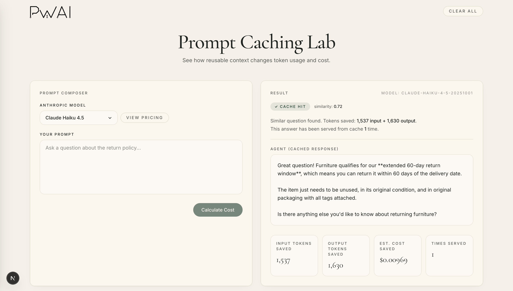
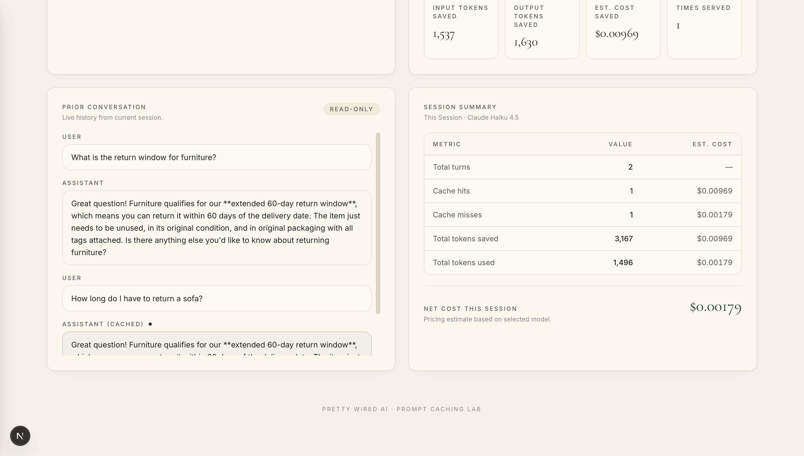

# Prompt Cache Lab

A web UI that visually demonstrates how semantic response caching reduces AI cost, showing cache hits, tokens saved, and session analytics in real time.

<table>
  <tr>
    <td></td>
    <td></td>
  </tr>
</table>

## Prerequisites

- Python 3.10+
- Node.js 18+
- An [Anthropic API key](https://console.anthropic.com/)
- An [OpenAI API key](https://platform.openai.com/) (used for embeddings)
- An [Azure DocumentDB cluster](https://learn.microsoft.com/azure/documentdb/quickstart-portal#create-a-cluster)

Install the API bridge dependencies:

```bash
pip install -r api/requirements.txt
```

Install the web UI dependencies:

```bash
cd web && npm install
```

Set the following environment variables (or add them to a `.env` file in the project root):

```bash
export CONNECTION_STRING="your-azure-documentdb-connection-string"
export ANTHROPIC_API_KEY="your-anthropic-api-key"
export OPENAI_API_KEY="your-openai-api-key"
```

## Run the Sample

First, run the setup script once to create the required database indexes:

```bash
python setup.py
```

In one terminal, start the API bridge:

```bash
uvicorn api.server:app --reload --port 8000
```

In a second terminal, start the web UI:

```bash
cd web && npm run dev
```

Open [http://localhost:3000](http://localhost:3000) in your browser. Type a question, and the UI will show whether the response came from the cache or from Claude, along with tokens saved and session-level cost analytics.

## Reset the Database

### Delete the database

To drop the entire database (all cached responses and session logs), run:

```bash
python delete_database.py
```

This permanently removes all collections and data from your Azure DocumentDB cluster.

### Start over

After deleting the database, re-run the setup script to recreate the required indexes before using the app again:

```bash
python setup.py
```

Then restart the API bridge and web UI as described in [Run the Sample](#run-the-sample). The database will be seeded with new data as you interact with the app.

## Issues & Questions

If you run into any problems or have questions, please [file an issue](../../issues).
